# NodeSeek 用户 AI 画像

一个面向 [NodeSeek](https://www.nodeseek.com/) 的 Tampermonkey / Userscript 插件。它会整理账号公开资料、主题与评论，并调用你自己配置的 AI API，生成快速用户画像或更完整的深度交易分析。

> 它不是“诈骗概率计算器”，也不是 NodeSeek 官方信用评分。它做的是把分散在公开历史中的线索整理出来，帮助你少翻几十页帖子。

当前版本：**v2.7.0**

发布状态：**v2.7 功能与发布前清单已测试通过，Greasy Fork 待发布**

> 作者：yellow13441  
> 联系方式：yellow13441@gmail.com  
> License：[MIT](LICENSE)

---

## ✨ v2.7 功能一览

| 能力 | 说明 |
| --- | --- |
| 🧭 快速画像 | 汇总账号硬信息、近期重心、可辨识行为与交易速览 |
| 🔍 深度交易分析 | 扩大历史范围，整理交易链、第三方反馈、管理记录和风险语境 |
| 📊 可配置采样 | 快速画像与深度分析分别配置页数、样本上限、采样策略和语境核验 |
| ✍️ 自定义画像 | 保存多套 Prompt 预设，附带实用示例、复制按钮和最终结构预览 |
| 🤖 多 AI Provider | DeepSeek、OpenAI 官方与第三方 OpenAI-Compatible 独立保存 |
| ⚡ 多用户并发 | 每个 UID 独立维护任务、进度、结果与终止控制 |
| 📊 Token 与耗时 | 展示 Token、缓存、模型请求次数、总耗时与模型等待时间 |
| 🪟 可操作浮窗 | 画像与设置窗口均可移动、调整大小；画像窗口还支持钉住 |
| 🖼️ 图片分享 | 复制图片、保存 PNG、完整内容截图、上传 16 图床并复制 Markdown |

---

## 📦 安装

### GitHub

- 项目仓库：[yellow13441/nodeseek-ai-profile](https://github.com/yellow13441/nodeseek-ai-profile)
- 正式脚本：[nodeseek-ai-profile.user.js](nodeseek-ai-profile.user.js)
- Raw 安装地址：[点击打开脚本](https://raw.githubusercontent.com/yellow13441/nodeseek-ai-profile/main/nodeseek-ai-profile.user.js)

安装步骤：

1. 安装 Tampermonkey 或兼容的 Userscript 管理器。
2. 打开上面的 Raw 安装地址。
3. 在脚本管理器中确认安装。
4. 打开或刷新 NodeSeek 页面。

### Greasy Fork

> 尚未正式发布，发布后补充。

```text
TODO_GREASY_FORK_URL
```

---

## ⚙️ 首次配置

可以从两个入口打开设置：

1. Tampermonkey 菜单 → `⚙️ NodeSeek AI 设置`
2. AI 画像窗口右上角 → `⚙`

<p align="center">
  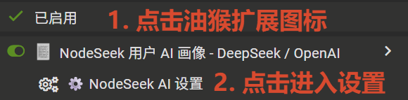
</p>

v2.7 把设置拆成四个互不混杂的页签：

- `🤖 AI接口`
- `📊 分析模式`
- `✍️ 自定义画像`
- `🖼️ 图床`

设置窗口首次打开会以合适尺寸居中显示。拖动标题栏只移动窗口，右下角手柄只调整大小；窗口位置、尺寸和上次页签会在本地保存。双击标题栏或 resize 手柄可以恢复默认尺寸与位置。

---

## 🧭 快速用户画像

点击用户名旁边的 **「AI画像」**，脚本会先读取以下公开硬信息：

- NodeSeek 等级
- 加入天数
- 鸡腿
- 星辰
- 总主题数
- 总回复数

随后按“分析模式”中的配置抽取公开主题与评论，生成：

- 一句话画像
- 近期活动重心
- 值得留意的行为
- 具体标签
- 简要交易速览

生成过程中会持续显示采样数量、采样策略、低信息回复过滤、模型等待时间和可终止入口。

<p align="center">
  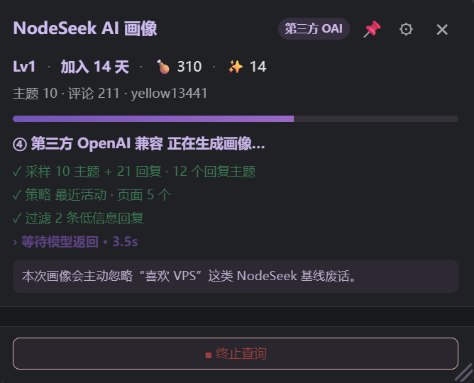
</p>

<p align="center">
  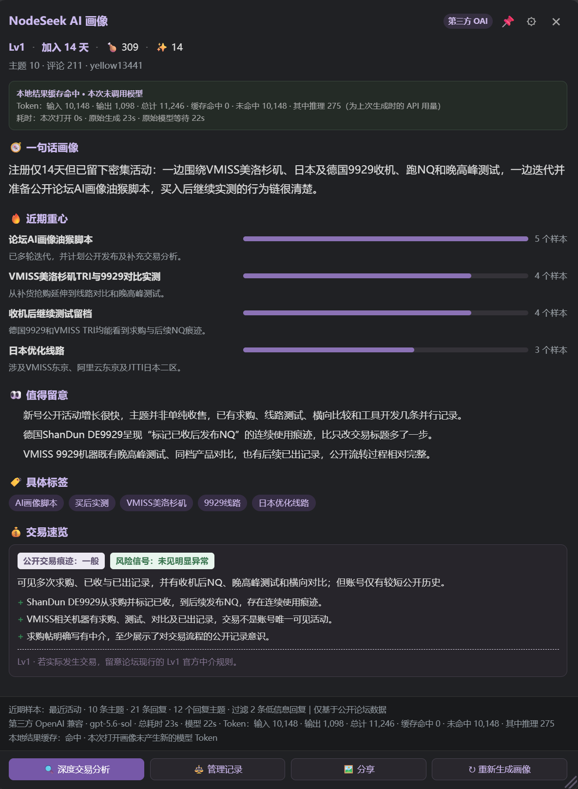
</p>

### NodeSeek 基线过滤

以下描述对大量 NodeSeek 用户都成立，不应自动成为画像核心：

- 喜欢 VPS
- 关注服务器
- 讨论网络线路
- 参与二手交易
- 对 Linux 感兴趣

脚本会继续寻找更有辨识度的公开模式，例如偏好的地区、线路或商家，更像收机还是出机，是否经常买后测试和留档，以及近期行为是否出现明显变化。

AI 可以有观点，也可以稍微有点人味，但不会为了“锐评”强行毒舌或刻意冒犯。

### v2.7 语境核验

单条评论很容易脱离上下文。v2.7 可以在模型准备写入负面、异常、推广或交易风险类判断时，按配置补充：

- 主题标题
- 首帖正文
- 目标评论
- 引用文本
- 附近楼层

快速画像支持关闭、智能或严格核验；深度交易中的风险语境核验始终保留。若二次语境复核失败或返回结构不完整，脚本会保留第一次生成的完整结果，不会让一份有效画像被“样本不足”的占位结果覆盖。

---

## 🔍 深度交易分析

用户名旁的下拉菜单可以直接选择：

- `🧭 快速画像`
- `🔍 直接深度交易分析`
- `⚖️ 管理记录`

因此，如果你本来就是为了交易前查看账号，可以跳过快速画像，直接进入深度分析。

深度模式会扩大公开历史采样，并重点整理：

- 更长时间范围的主题与回复
- 求购、出售、已收、已出等交易主题
- 交易帖正文和上下文
- 买后测试与后续反馈
- 求购 → 收到 → 测试 → 转出等公开行为链
- 第三方公开回复
- 管理记录
- 正向公开信号、风险点与无法确认的内容

<p align="center">
  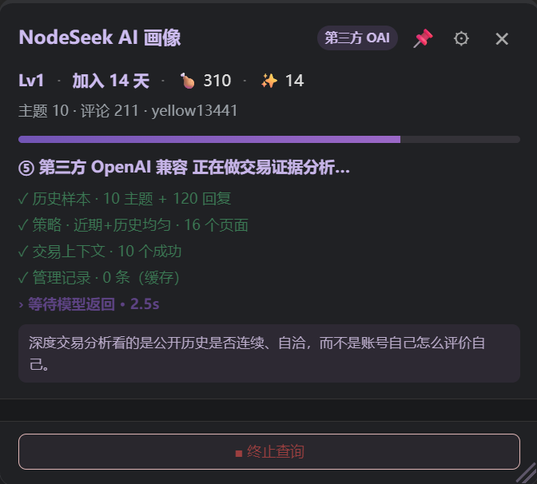
</p>

<p align="center">
  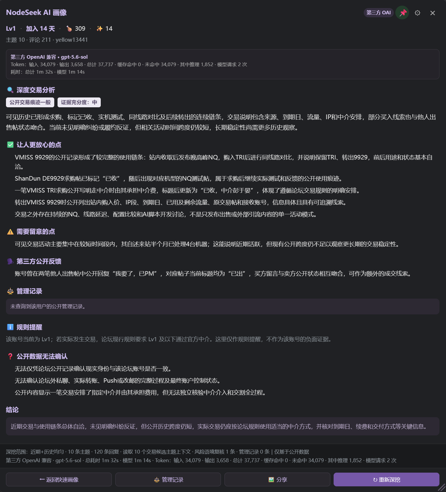
</p>

### 关于「已收 / 已出」

NodeSeek 中将：

```text
【收】→【已收】
【出】→【已出】
```

作为交易状态更新是正常行为。在没有相反证据时，用户自己更新的公开交易状态会被视为论坛历史的一部分。

评论区里的“我要了”“楼下止步”“已收到”“交易愉快”等内容可以作为额外佐证，但不会被设定为每笔交易必须存在的证明材料。脚本不会因为缺少第三方公开回复，就自动认定交易完成度低或可信度不足。

---

## 📊 v2.7 分析模式

快速画像与深度交易分析现在分别保存自己的数据预算。可配置项包括：

- 历史采样策略
- 主题与评论扫描页数
- 送入 AI 的主题与评论上限
- 同一主题评论上限
- 单条评论字符上限
- 语境核验数量
- 深度交易候选主题、每帖读取页数与第三方回复上限
- 是否在深度分析中自动包含管理记录

支持四种历史采样策略：

| 策略 | 适用场景 |
| --- | --- |
| 最近活动 | 优先观察近期状态，快速画像默认使用 |
| 全历史均匀抽样 | 在账号可见历史范围内均匀取样 |
| 随机抽样 | 用随机页面降低固定位置偏差 |
| 近期 + 历史均匀覆盖 | 兼顾当前状态与历史跨度，深度分析默认使用 |

设置页会根据请求数量和模型输入规模显示轻量、中等或高负载提示，也可以一键恢复推荐默认值。抓取更多并不必然更准确，但通常会增加 NodeSeek 请求、等待时间和 Token 消耗。

<p align="center">
  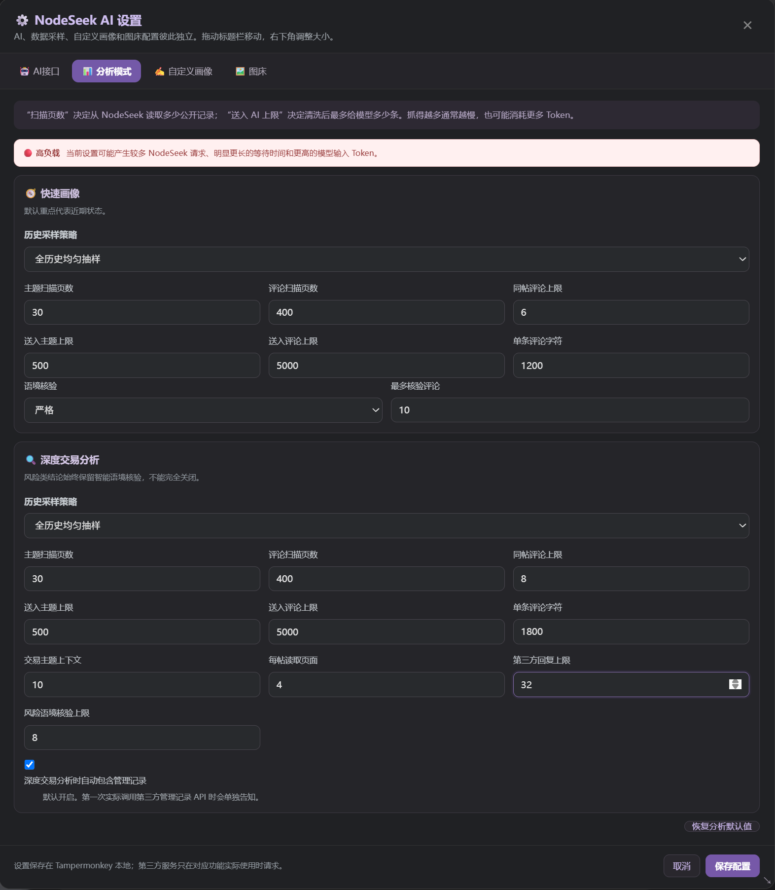
</p>

---

## ✍️ 自定义画像 Prompt

自定义 Prompt 只影响快速画像，不会覆盖深度交易分析的固定证据规则、管理记录规则、Prompt Injection 防护或风险语境核验。

v2.7 支持：

- 保存多套命名预设
- 新建、复制和删除预设
- 内置“技术兴趣与社区角色”示例
- 一键复制当前 Prompt
- 预览最终请求结构
- 保留账号硬信息、采样数据和固定安全边界

内置示例展示了推荐的结果结构，同时仍给模型保留了围绕公开主题与评论进行分析的空间。

<p align="center">
  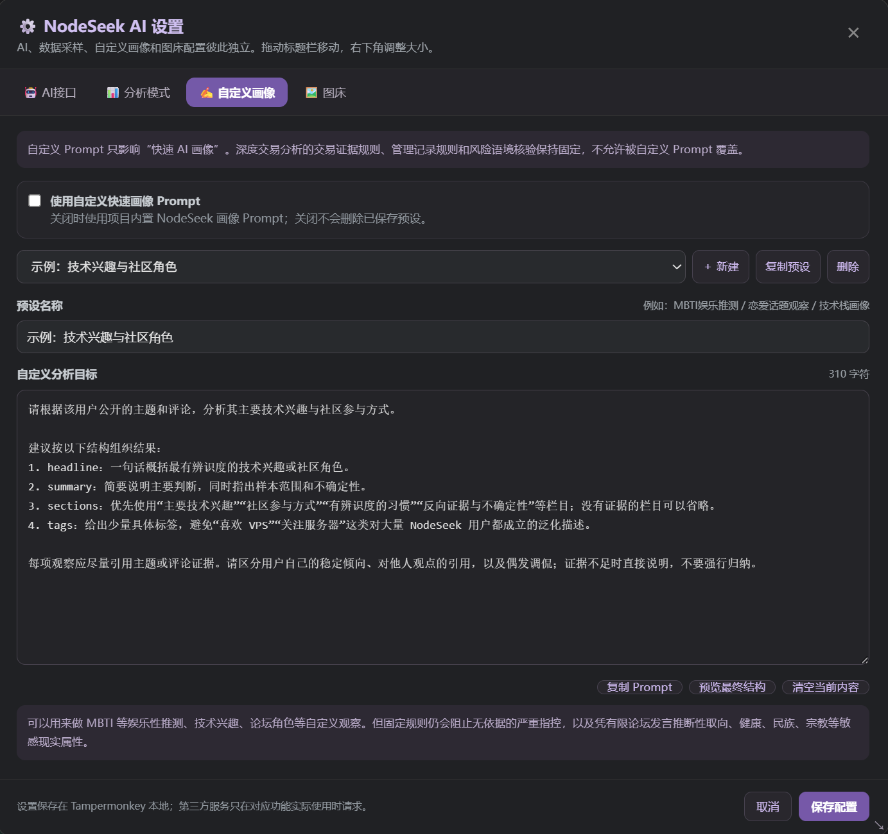
</p>

启用预设后，结果会明确标注自定义画像名称、采样策略、样本量、模型耗时与 Token。

<p align="center">
  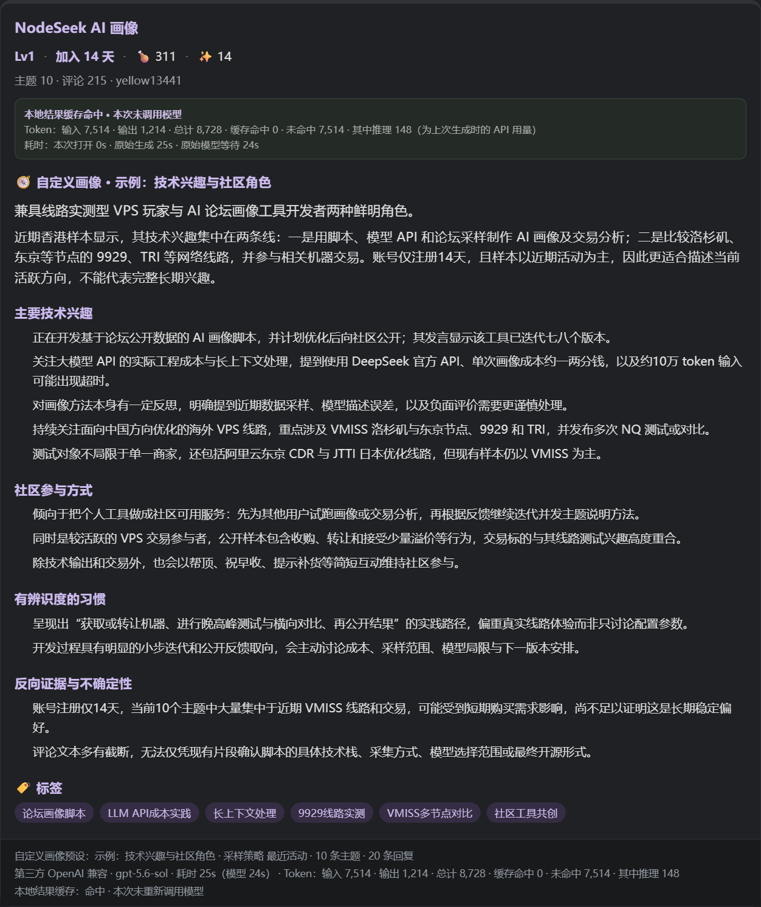
</p>

---

## 🤖 多 AI Provider

配置界面支持独立保存三套 AI 服务：

### DeepSeek 官方

```text
API URL: https://api.deepseek.com/chat/completions
Model: deepseek-v4-flash
```

### OpenAI 官方

```text
API URL: https://api.openai.com/v1/chat/completions
Model: gpt-5.6
```

### 第三方 OpenAI-Compatible

可以自行配置 API Key、API URL、Model，以及快速画像和深度交易各自的 reasoning 等级。三套 Provider 的配置分别保存在 Tampermonkey 本地，来回切换时不需要反复粘贴 Key。

<p align="center">
  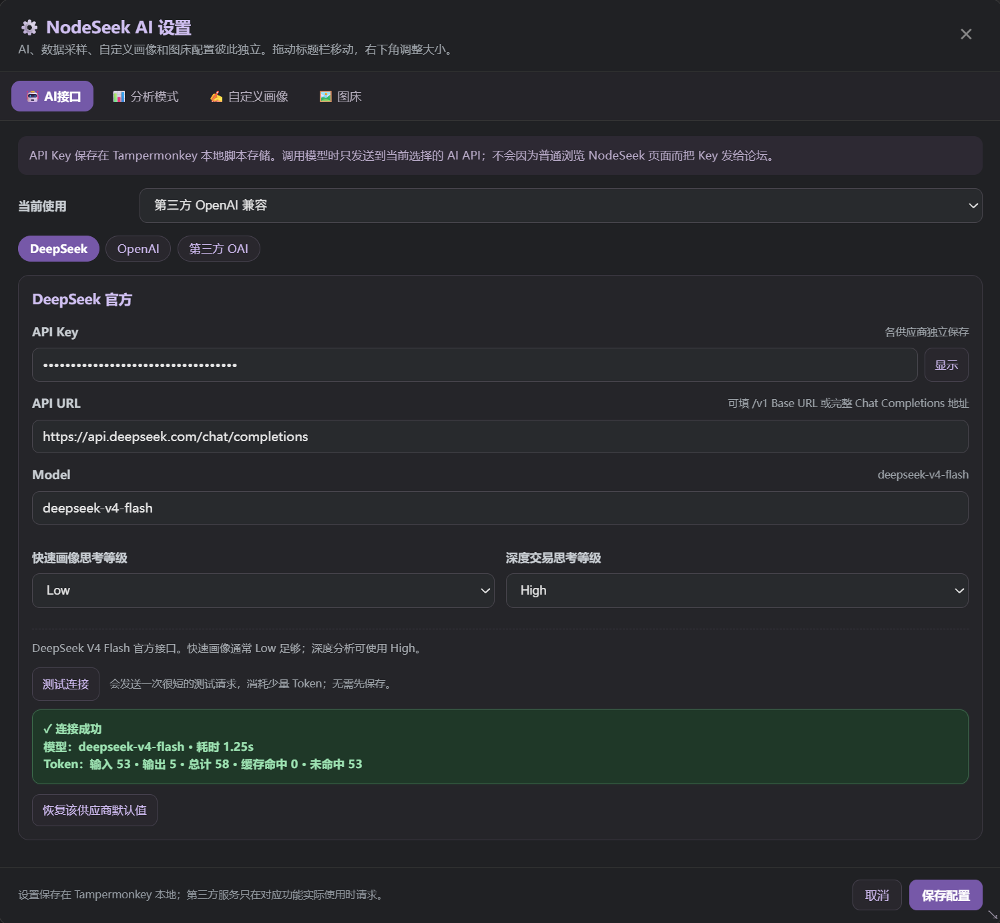
</p>

### 模型连接测试

“测试连接”使用当前表单内容，无需先保存。它会发送一次很短的请求，因此会产生少量 Token 消耗。

测试结果会直接显示在当前 Provider 的测试按钮下方，不再出现在整个设置页底部。成功时会展示模型、请求耗时和 Token；第三方 OpenAI-Compatible 如果需要兼容参数降级，也会明确标注“兼容模式”。

---

## ⚡ 多用户并发与任务控制

脚本按 UID 独立维护每个用户的快速画像、深度任务、进度、结果和终止句柄：

```text
用户 A
├─ 快速画像任务
├─ 深度交易任务
├─ 进度
└─ 结果

用户 B
├─ 快速画像任务
├─ 深度交易任务
├─ 进度
└─ 结果
```

因此可以在 A 分析期间继续查看 B，切回 A 查看进度，或只终止其中一个用户的任务。后台任务完成后会给出轻量提示，不会覆盖当前正在查看的其他用户。

### 终止查询

快速画像或深度分析进行中可以点击 **「■ 终止查询」**。确认后，脚本会尝试停止尚未完成的 fetch、`GM_xmlhttpRequest`、后续页面读取、模型请求和等待计时器。

> 请求一旦发到 AI 服务商，本地终止等待并不代表服务商一定没有产生 Token 消耗。

### 已查询状态与重新生成

- 默认：紫色 `AI画像`
- 正在分析：琥珀色 `⏳ AI画像`
- 已有结果或缓存：蓝色 `✓ AI画像`

状态只表示“你已经查过这个账号”，不代表脚本认为它安全或可信。重新生成快速画像或重新深挖都会二次确认，避免误触产生新的 Token。

---

## ⚖️ 管理记录

脚本支持查询用户公开管理记录，并默认纳入深度交易分析。数据来自第三方服务，不是 NodeSeek 官方公开 API。

首次实际查询前会说明将发送的信息；查询失败、超时、限流或第三方服务不可达时，只会跳过这个数据源，不会让画像或深度分析整体失败。

同时遵循以下规则：

- 普通水贴或一般版规处罚不会自动等同交易风险
- 只有与交易风险确实相关的具体内容才允许影响报告判断
- 原始接口数据不被修改
- 展示 `actions_text` 时，可把 UTC 美式时间转换为北京时间
- 深度报告中可以内联展开或收起管理记录
- 分享图片会跟随当前展开状态

---

## 📊 Token、耗时与缓存

快速画像和深度报告会尽量展示供应商返回的：

- 输入、输出与总 Token
- Prompt Cache 命中与未命中
- 缓存写入 Token（供应商支持时）
- Reasoning Token（供应商支持时）
- 模型请求次数
- 总耗时与模型等待时间

如果命中脚本本地结果缓存，会明确显示“本次未调用模型”，并保留上次生成时的 API 用量和原始耗时，避免把重新打开缓存误解为又消耗了一次 Token。

不同 Provider、Model、reasoning、采样设置和 Prompt 预设使用不同缓存签名；影响分析结果的配置变化不会错误复用旧结果。

---

## 🪟 可移动、缩放与钉住

画像面板是可操作的浮动窗口：

- 拖动标题栏移动
- 右下角调整宽高
- `📌` 钉住
- 钉住后点击网页其他区域不会自动隐藏
- 分析完成时给出明显状态变化

设置窗口同样把拖动与 resize 分开处理，并保存窗口位置与尺寸。长时间分析时，可以把窗口移到屏幕角落继续阅读帖子。

---

## 🖼️ 图片分享

点击 **「🖼️ 分享」** 可以：

- 适配当前窗口高度
- 复制图片到剪贴板
- 保存 PNG
- 上传 16 图床并复制 Markdown

<p align="center">
  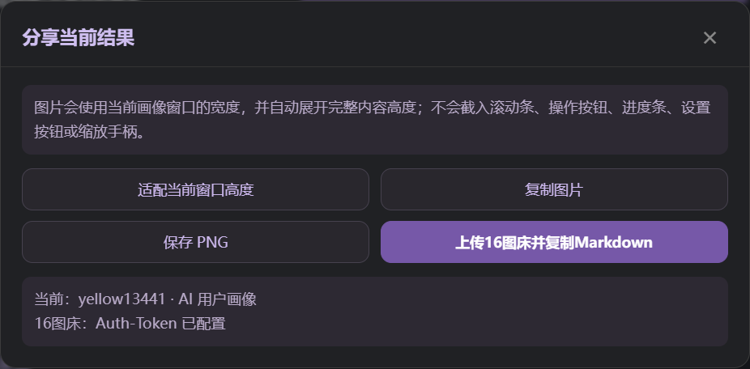
</p>

分享图片会按“当前画像窗口宽度 + 完整内容高度”重新渲染，而不是只截取当前滚动区域，并自动移除操作按钮、设置按钮、查询进度、滚动条和 resize 手柄。

---

## ☁️ 16 图床

16 图床是可选功能，支持：

- 手动填写或随机生成 Auth-Token
- 上传图片并自动复制 Markdown
- 保存最近上传记录
- 打开图片、复制 Markdown
- 删除远端图片

<p align="center">
  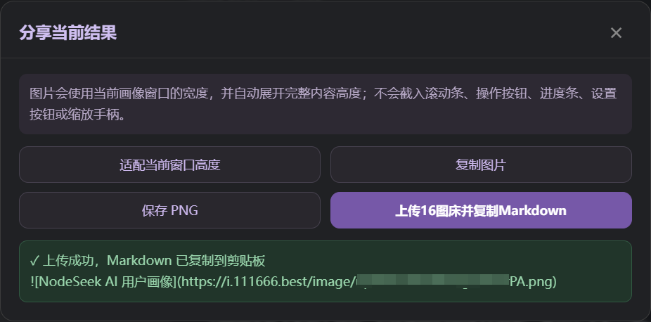
</p>

<p align="center">
  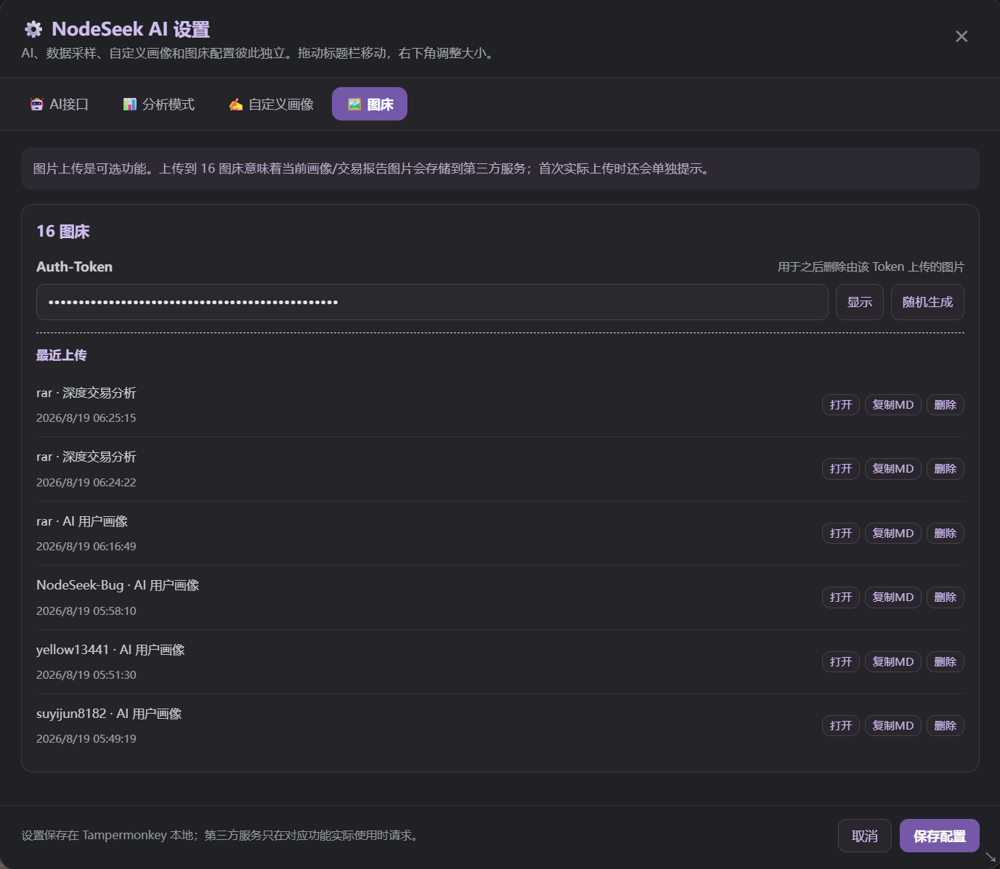
</p>

第一次上传前会明确提示图片将发送到第三方图床。在画像或深度分析仍运行时，也可以单独修改并保存图床 Auth-Token；只有 AI、分析模式或自定义 Prompt 等会影响分析结果的配置才会暂时阻止保存。

---

## 📈 项目演进

### v2.1 — 等待体验与深度报告可靠性

- 调整等待提示节奏
- 修复高推理模式只返回 reasoning、最终内容为空的问题
- 增加输出预算和自动重试

### v2.2 — Token 透明化与 OpenAI-Compatible

- 展示 Token、Prompt Cache 与 Reasoning Token
- 增加 OpenAI 官方及第三方兼容接口
- 修正“已收 / 已出必须有第三方确认”的错误前提

### v2.3 — 图形化多 Provider 配置

- DeepSeek、OpenAI、第三方 OAI 分别保存
- API Key、URL、Model 和 reasoning 均可在界面配置
- API Key 从源码迁移到 Tampermonkey 本地存储

### v2.4 — 管理记录与模型连接测试

- 深度分析默认查询管理记录
- 第三方 API 首次调用前告知
- 管理记录失败时独立降级
- 管理记录时间显示修正
- 画像面板支持 resize

### v2.5 — 浮窗与图片分享

- 标题栏拖动与 `📌` 钉住
- 复制图片、保存 PNG 与完整结果截图
- 16 图床上传、Markdown 和历史管理

### v2.6 — 多用户并发与任务生命周期

- 按 UID 隔离任务、进度、结果和终止控制
- 支持直接深度交易分析
- 增加终止查询、已查状态与重新生成确认
- 管理记录在深度报告内联展开

### v2.7 — 可配置分析与自定义画像

- 四页签设置中心
- 快速画像与深度分析分别配置采样策略和数据预算
- 增加关键评论语境核验
- 增加自定义 Prompt 预设、内置示例、复制和结构预览
- 展示总耗时与模型等待时间
- 设置窗口支持独立拖动、resize 和几何状态保存
- 修复连接测试结果位置、图床 Token 保存限制和画像复核降级问题

完整记录见 [CHANGELOG.md](CHANGELOG.md)。

---

## 🔐 隐私与第三方服务

### AI API Key

Key 通过 `GM_setValue` 保存在 Tampermonkey 脚本本地存储中。调用模型时，Key 只会发送到当前选择的 AI API：

- DeepSeek Key → DeepSeek API
- OpenAI Key → OpenAI API
- 第三方 OAI Key → 你自行配置的第三方 API

普通浏览 NodeSeek 页面不会把 Key 发送给论坛。

### NodeSeek 公开数据

画像与交易分析只使用脚本能够读取到的公开论坛信息。采样结果不是账号完整历史；没有出现在样本里的内容，不能解释为用户从未关注或参与。

### 管理记录查询

管理记录使用第三方服务：

```text
https://api.xxboxx.de
```

首次查询前脚本会说明可能发送目标用户名、当前登录 NodeSeek 用户名与 UID，用于查询和限流。

### 16 图床

图片上传使用：

```text
https://i.111666.best
```

上传意味着当前画像或交易报告图片会存储到第三方图床服务器。Auth-Token 用于上传及之后删除相应图片。

---

## ⚠️ 交易分析免责声明

本项目分析的是 NodeSeek 上可见的公开账号历史。它不是：

- 实名认证系统
- NodeSeek 官方信用评分
- 交易担保
- 诈骗检测器
- 现实身份验证工具

请记住：

- 老号不代表绝对安全
- Lv1 不代表一定危险
- 高等级不是信用担保
- 没看到负面记录不代表风险为零
- AI 可能理解错误
- 第三方接口可能返回错误或不完整数据
- 论坛公开记录无法确认线下私聊、实际转账或最终账户控制状态

涉及较大金额时，请遵守 NodeSeek 规则，并结合中介、账号历史、交易上下文和自己的判断。

---

## 🛠️ 开发与发布检查

正式脚本：

```text
nodeseek-ai-profile.user.js
```

语法检查：

```bash
node --check nodeseek-ai-profile.user.js
```

v2.7 发布前测试：

- [x] DeepSeek 测试连接
- [x] OpenAI 官方测试连接
- [x] 第三方 OpenAI-Compatible 测试与兼容降级
- [x] 测试结果显示在当前 Provider 按钮下方
- [x] 快速画像与语境核验
- [x] 直接深度交易分析
- [x] 最近、均匀、随机、混合采样策略
- [x] 分析负载提示与恢复默认值
- [x] 自定义画像示例、预设管理、复制 Prompt 与结构预览
- [x] A / B 两个用户并发分析
- [x] 并发后切回用户查看进度与结果
- [x] 终止快速画像
- [x] 终止深度交易
- [x] 重新生成确认
- [x] 已查用户按钮状态同步
- [x] 管理记录查询、展开与收起
- [x] 管理记录服务错误降级
- [x] 分享时管理记录展开与收起状态
- [x] 复制图片
- [x] 保存 PNG
- [x] 16 图床上传与 Markdown 复制
- [x] 16 图床删除
- [x] 分析运行时单独保存图床 Auth-Token
- [x] 画像窗口钉住、拖动与 resize
- [x] 设置窗口居中、拖动、resize 与状态恢复
- [x] 深色模式

---

## 🙏 致谢

这个项目是在 NodeSeek 社区已有想法和工具之上继续迭代出来的。

### 「AI用户画像的油猴脚本」提供最初思路

NodeSeek 帖子：[post-731189-1](https://www.nodeseek.com/post-731189-1)

感谢该帖子提供“把用户公开论坛活动交给 AI 做快速画像”的产品灵感。本项目之后重新设计了提示词、账号硬信息、交易分析、多模型、并发任务和分享能力。

### sluggerbox — NS 管理记录快捷查看

Greasy Fork：[NS 管理记录快捷查看](https://greasyfork.org/zh-CN/scripts/567915-ns-%E7%AE%A1%E7%90%86%E8%AE%B0%E5%BD%95%E5%BF%AB%E6%8D%B7%E6%9F%A5%E7%9C%8B)

感谢 sluggerbox 提供完整的管理记录快捷查看方案及配套的第三方公开查询服务。本项目在这项成熟能力之上进行整合，没有重复创建数据源。

### sss1231 — 管理记录时区修正

NodeSeek 帖子：[post-870735-1](https://www.nodeseek.com/post-870735-1)

感谢 sss1231 提供显示时间的修正思路：在前端显示阶段识别 UTC 美式时间并转换为北京时间，不修改接口原始数据。

### 16 图床

感谢 [16 图床](https://111666.best/) 向社区提供图片托管与 API 服务。

### html2canvas

感谢 [html2canvas](https://html2canvas.hertzen.com/) 提供浏览器端 DOM 截图能力。

---

## ⭐ Star / Issue / PR

如果这个脚本对你有帮助，欢迎给仓库点一个 Star。

也欢迎提交 Issue 或 PR，尤其是：

- 分析翻车样本
- 提示词改进
- 采样策略建议
- 第三方 OpenAI-Compatible 兼容情况
- UI 与使用流程问题

很多迭代都来自实际使用时发现：“这个结果虽然没错，但还没有解决真正的问题。”
